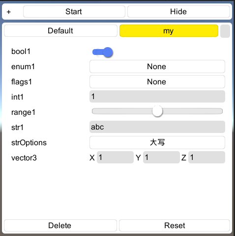

## Configure

参数调试工具，静态属性或字段通过图形化界面运行时修改值，支持保存多个版本配置


## 预览



## 使用

```c#
[RuntimeInitializeOnLoadMethod(RuntimeInitializeLoadType.AfterSceneLoad)]
static void RuntimeInitializeOnLoadMethod()
{
    if (!Configuration.IsInitialized)
    {
        //配置文件读取目录
        Configuration.Sources.Add(new DirectoryConfigurationSource(Path.Combine(Application.persistentDataPath, Configuration.ConfigDirectory)));
        //设置用户关键字，默认为空，比如用户ID
        Configuration.SetUserKeyword(string.Empty);
        
        //初始化调试界面
        if (Configuration.IsDebugBuild)
        {
            ConfigurationGUI.IsEnabled = true;
            ConfigurationGUI.Initialize();
            ConfigurationGUI.IsShow = true;
        }
        //初始化，在调试界面初始化之后调用，加载用户定制配置
        Configuration.Initialize();
    }
}
```

### 


## 配置化属性


```c#
[Configurable]
public static float float1=0.5f;
```

1. `静态` 的`属性`或`字段`
2. 添加`[Configurable]`特性
3. 可选，设置`默认值`: 0.5f


## Attribute

### DescriptionAttribute

描述信息，在UI中Tips显示


### RangeAttribute

区间值，支持水平滑块UI

```c#
[Configurable]
[Range(0,1f)]
public static float range1 = 0.5f;
```


### EnumValuesAttribute

定制枚举值

```c#

[Configurable]
[EnumValues(new object[] {"abc","ABC","123"}, new string[] {"小写","大写","数字"})]
public static string str1 = "ABC";
```


### HideInInspector，HideAttribute

UI中不显示该属性


## 调试界面

调试界面，编辑配置值。


### 打开

点击屏幕右上角空白区域虚拟按钮，显示编辑配置界面

- `Build Settings` 面板中勾选 `Development Build`，使环境处于调试模式
-  `Configuration.IsDebugBuild`为`true`时才会启用

### 关闭

`Hide`按钮关闭界面

### 保存

再次点击 Defualt 按钮

### Start

重新加载该场景

### Reset

重置为初始值

### 新建配置

点击 `Default` 按钮右边的输入框，输入字符后回车


### 属性

- IsEnabled

  是否启用该UI

- IsShow

  是否显示UI

- ShowButtonScreenRect

  虚拟按钮区域