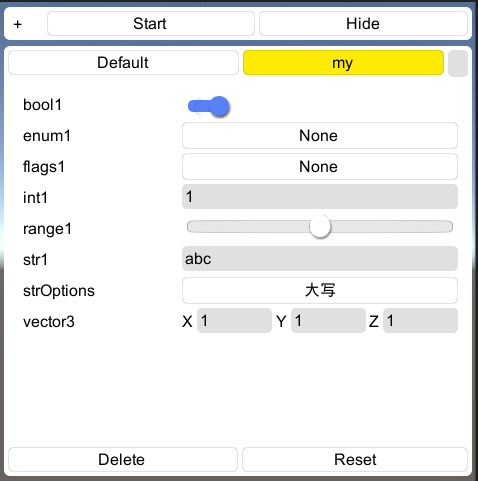

## Configure

参数调试工具，静态属性或字段通过图形化界面运行时修改值，支持保存多个版本配置


## manifest.json

```
"unity.guiextensions": "https://github.com/liuwenjiexx/Unity.GuiExtensions.git",
"unity.configure": "https://github.com/liuwenjiexx/Unity.Configure.git?path=/Assets/Plugins/Unity.Configure",
```


## 预览

```
[Configurable]
public static int int1 = 1;
    
[Configurable]
[UnityEngine.Configure.Range(0, 1f)]
public static float range1 = 0.5f;
```



